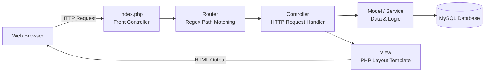
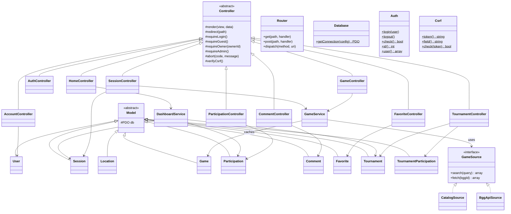

# Application Architecture

The application is built using a custom, lightweight **MVC (Model-View-Controller)** architecture implemented in clean PHP 8.3 without external framework dependencies. This document outlines the request lifecycle, the system's class architecture, and the design decisions.

---

## 1. Request Lifecycle

The application routes all web requests through a single entry point (the Front Controller pattern) to ensure central control over sessions, configuration, and security checks.

### Execution Steps
1. **Bootstrapping:** The web server directs all requests to `index.php` via rewrite rules (defined in `.htaccess`). The front controller registers the class autoloader, initializes server-side sessions, parses configuration files from `.env`, determines error reporting settings based on environment (local vs production), initializes the database connection singleton, and loads the routing definitions.
2. **Routing:** The `Router` inspects the request URI and HTTP method. It converts parameters (like `/sessions/{id}`) into regular expressions, matches the path, and invokes the configured controller class and action method.
3. **Controller Execution:** The instantiated controller verifies authorization rules (e.g., checks if user authentication is required). It processes input arguments, interacts with data models or orchestrating services, and initiates view rendering or page redirection.
4. **Data Management:** Models execute parameterized SQL queries against MySQL using PDO. Services orchestrate operations that span multiple models (e.g., compiling data metrics for the dashboard or communicating with BGG).
5. **Presentation:** The base controller utilizes output buffering to capture the output of the requested view template and injects it into a common `layout.php` master template to compose the final HTML response.

---

## 2. Architectural Layers

| Layer | Directory | Responsibility |
|---|---|---|
| **Core** | `app/src/Core/` | Infrastructure code: routing, database connections, base classes, authentication wrappers, CSRF protection, and avatar helpers. |
| **Controller** | `app/src/Controllers/` | HTTP entry points. Responsible for request parameter validation, authorization checks, orchestrating models/services, and selecting views. |
| **Model** | `app/src/Models/` | Data mapping layer. Encapsulates SQL queries and data structure mappings for a single database table. |
| **Service** | `app/src/Services/` | Business logic layer. Used when logic spans across multiple models or handles external interfaces (such as BGG). |
| **View** | `app/views/` | HTML templates integrated with CSS stylesheets (Tailwind CSS and DaisyUI components). |

---

## 3. Class Diagram

The following diagram illustrates the relationship between the base classes, the models, controllers, and services in the system.

---

## 4. Implemented Design Patterns and Alternatives

### Front Controller Pattern
* **Design Decision:** The system routes all incoming HTTP traffic through a single entry point (`index.php`).
* **Rationale:** A single entry point allows for consistent preprocessing of requests. Global operations, such as starting a session, parsing configurations, loading environment variables, and handling uncaught exceptions, are declared in one file.
* **Alternative Considered:** Multi-script routing (creating individual files like `login.php`, `create_session.php`, `delete_comment.php` in the public directory). This was rejected because it introduces significant code duplication, makes refactoring global configuration difficult, and exposes the system to directory traversal vulnerabilities.

### Singleton Pattern
* **Design Decision:** The database connection wrapper `Database` restricts instantiation to a single static connection instance.
* **Rationale:** Establishing a MySQL connection is computationally expensive. Using a singleton pattern ensures that exactly one database connection is opened per request lifecycle, reducing database server workload and latency.
* **Alternative Considered:** Dependency Injection of a connection pool or creating a connection inside each model constructor. A pool was rejected because standard PHP has a short request lifespan where persistent pool management is complex. Creating a connection per model was rejected because instantiating multiple models on a page would open dozens of redundant TCP connections to MySQL.

### Strategy Pattern
* **Design Decision:** The system abstracts BoardGameGeek queries through the `GameSource` interface, implementing `CatalogSource` (local db) and `BggApiSource` (remote BGG API) strategies.
* **Rationale:** This enables switching between local prefix-search indexing (which operates without API tokens and does not require an active internet connection) and live BGG XML queries. Switching requires changing a single key in the `.env` configuration file, and the rest of the application remains unaware of the change.
* **Alternative Considered:** Direct hardcoded API calls inside model code. This was rejected because it binds the application tightly to the external BGG API, making offline development impossible and causing API key rate-limiting to break the entire application.

### Template Method / Class Inheritance
* **Design Decision:** Base classes `Controller` and `Model` define common execution flows and shared helper utilities.
* **Rationale:** It allows child controllers to inherit session authorization tools (`requireLogin`, `requireOwner`) and view render capabilities without code replication. Child models automatically share the same PDO instance initialized by the system database bootstrap.
* **Alternative Considered:** Composition-based controller traits or helper functions. While composition is highly flexible, simple inheritance is cleaner and easier to read for lightweight projects.

---

## 5. Unified Routing Table

Below is the complete list of HTTP routes mapping client paths to controller actions:

| HTTP Method | Route URI Path | Controller | Controller Action | Purpose |
|---|---|---|---|---|
| **GET** | `/` | `HomeController` | `index` | Displays user dashboard if logged in, or the application landing page. |
| **GET** | `/register` | `AuthController` | `showRegister` | Displays the new account registration form. |
| **POST** | `/register` | `AuthController` | `register` | Processes registration form submission. |
| **GET** | `/login` | `AuthController` | `showLogin` | Displays the user login credentials form. |
| **POST** | `/login` | `AuthController` | `login` | Validates credentials and logs the user in. |
| **GET** | `/logout` | `AuthController` | `logout` | Clears sessions and logs out the current user. |
| **GET** | `/sessions` | `SessionController` | `index` | Lists and filters active gaming sessions (by game, location, vacancies). |
| **GET** | `/sessions/create` | `SessionController` | `create` | Displays form to schedule a new board game session. |
| **POST** | `/sessions` | `SessionController` | `store` | Validates and saves a new session in the database. |
| **GET** | `/sessions/{id}` | `SessionController` | `show` | Displays details, participants, and comments for a session. |
| **GET** | `/sessions/{id}/edit` | `SessionController` | `edit` | Displays the editing form for a session (restricted to owner). |
| **POST** | `/sessions/{id}/update` | `SessionController` | `update` | Saves modifications made to a session (restricted to owner). |
| **POST** | `/sessions/{id}/delete` | `SessionController` | `destroy` | Deletes a session and associated records (restricted to owner). |
| **POST** | `/sessions/{id}/cancel` | `SessionController` | `cancel` | Sets session status to cancelled (restricted to owner). |
| **POST** | `/sessions/{id}/reopen` | `SessionController` | `reopen` | Sets session status back to open (restricted to owner). |
| **GET** | `/sessions/{id}/calendar` | `SessionController` | `calendar` | Generates and downloads an iCalendar (.ics) file for the session. |
| **POST** | `/sessions/{id}/join` | `ParticipationController` | `join` | Requests to join a session (registers as pending or approved). |
| **POST** | `/sessions/{id}/leave` | `ParticipationController` | `leave` | Removes the authenticated user from a session's participants. |
| **POST** | `/sessions/{id}/approve` | `ParticipationController` | `approve` | Approves a pending participant's request (restricted to creator). |
| **POST** | `/sessions/{id}/reject` | `ParticipationController` | `reject` | Rejects/removes a participant from a session (restricted to creator). |
| **POST** | `/sessions/{id}/comments` | `CommentController` | `store` | Saves a new discussion comment under a session. |
| **POST** | `/comments/{id}/delete` | `CommentController` | `destroy` | Deletes a comment (restricted to comment author or administrator). |
| **GET** | `/games` | `FavoriteController` | `index` | Displays the user's personal board game collection favorites. |
| **POST** | `/games/{id}/favorite` | `FavoriteController` | `toggle` | Toggles whether a game is marked as a user favorite. |
| **GET** | `/games/search` | `GameController` | `search` | JSON endpoint returning board game matches for autocompleters. |
| **GET** | `/account` | `AccountController` | `index` | Displays user profile and security update options. |
| **POST** | `/account/profile` | `AccountController` | `updateProfile` | Updates the profile details (such as hometown city). |
| **POST** | `/account/password` | `AccountController` | `updatePassword` | Validates old password and updates user password hash with pepper. |
| **GET** | `/tournaments` | `TournamentController` | `index` | Lists all active tournaments. |
| **GET** | `/tournaments/create` | `TournamentController` | `create` | Displays form to create a new board game tournament. |
| **POST** | `/tournaments` | `TournamentController` | `store` | Validates and stores a new tournament in the database. |
| **GET** | `/tournaments/{id}` | `TournamentController` | `show` | Displays tournament details, schedules, and members. |
| **POST** | `/tournaments/{id}/delete` | `TournamentController` | `destroy` | Deletes a tournament (restricted to tournament creator). |
| **POST** | `/tournaments/{id}/join` | `TournamentController` | `join` | Joins a tournament as a participant. |
| **POST** | `/tournaments/{id}/leave` | `TournamentController` | `leave` | Unregisters a participant from a tournament. |
