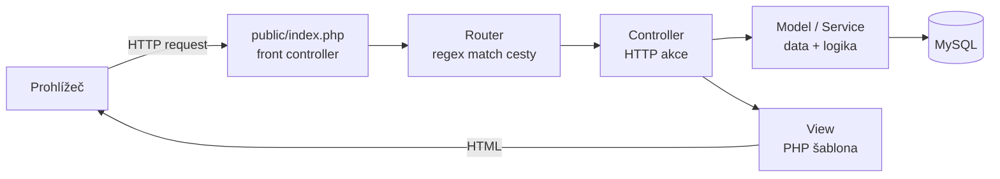
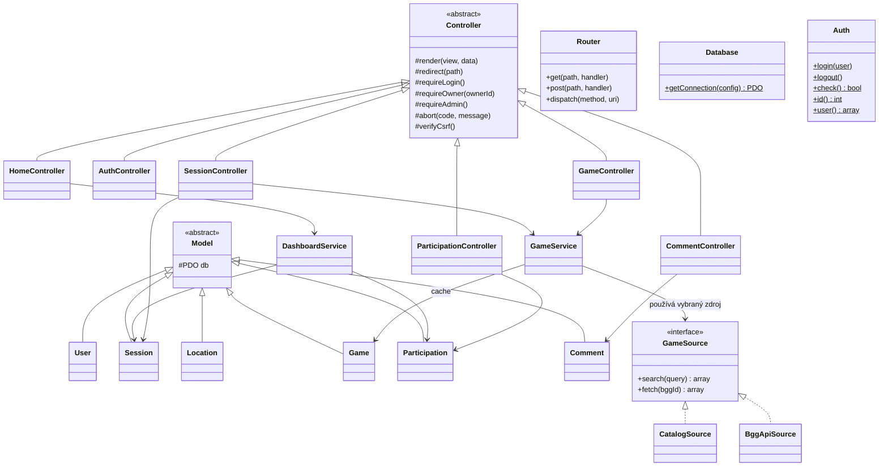
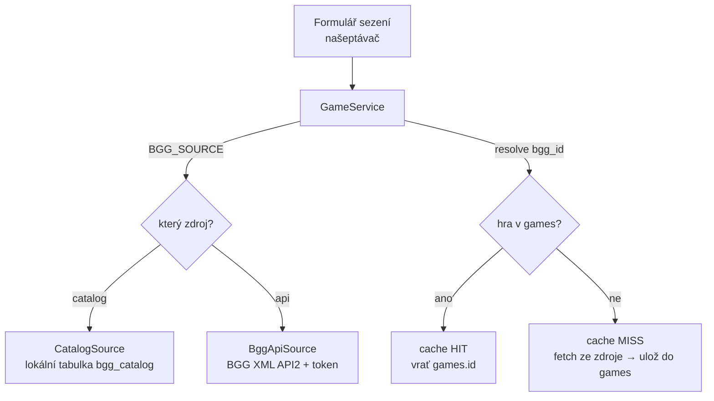

# Architektura

Aplikace je postavená na vlastní **MVC** architektuře v čistém PHP, bez frameworku.
Veškerý provoz prochází jediným vstupním bodem (front controller), který request
předá routeru a ten příslušnému controlleru.

## Tok requestu

1. **`public/index.php`** zaregistruje autoloader, načte config, nastartuje session,
   definuje routy a zavolá `Router::dispatch()`.
2. **`Router`** porovná cestu (podpora parametrů typu `/sessions/{id}` přes regex)
   a zavolá odpovídající metodu controlleru.
3. **Controller** ověří oprávnění (`requireLogin`…), zpracuje vstup, zavolá model/service
   a vykreslí view (`render`), nebo přesměruje (`redirect`).
4. **Model** komunikuje s DB přes PDO (prepared statements), **Service** drží logiku
   napříč více modely.
5. **View** je PHP šablona vykreslená do společného `layout.php`.

## Vrstvy a zodpovědnosti

| Vrstva         | Složka                | Zodpovědnost                                              |
|----------------|-----------------------|----------------------------------------------------------|
| **Core**       | `app/src/Core`        | Infrastruktura: router, DB, base třídy, auth, CSRF.       |
| **Controller** | `app/src/Controllers` | HTTP tok — jeden controller na zdroj. Tenké, delegují.    |
| **Model**      | `app/src/Models`      | Data jedné entity (jedna tabulka). Pouze SQL přes PDO.    |
| **Service**    | `app/src/Services`    | Orchestrace a business logika napříč modely / externí API.|
| **View**       | `app/views`           | Prezentace (PHP šablony + Tailwind/DaisyUI).              |

## Class diagram

### Použité návrhové vzory
- **Front controller** — jediný vstupní bod (`index.php`).
- **Singleton** — `Database` drží jediné PDO připojení.
- **Strategy** — `GameSource` se dvěma zaměnitelnými implementacemi (viz níže).
- **Template method / dědičnost** — base `Controller` a `Model` sdílejí společné chování.

## BGG pipeline

Aplikace pracuje se hrami přes rozhraní **`GameSource`**, které má dvě implementace.
Konkrétní zdroj se vybírá podle `.env` proměnné `BGG_SOURCE` — zbytek aplikace
o rozdílu neví.

- **Vyhledávání** (`search`) běží proti vybranému zdroji — u `catalog` je to lokální
  SQL dotaz nad ~30 000 hrami (bez tokenu, okamžité), u `api` živé volání BGG.
- **Cache** (`GameService::resolve`) je společná: hra se do tabulky `games` uloží
  **jen při prvním použití**; další sezení s toutéž hrou čtou z cache.
- **Přepnutí zdroje** = změna jediné hodnoty v `.env` (`BGG_SOURCE=catalog|api`).
  Důvodem dvou pipeline je, že BGG od 2025 vyžaduje registrovaný token se
  schvalováním v řádu týdnů — `catalog` zajišťuje plnou funkčnost i bez něj.

### Import katalogu
Tabulka `bgg_catalog` se plní z oficiálního BGG data dumpu (`bg_ranks.csv`)
jednorázovým skriptem, který filtruje jen hodnocené hry (`rank > 0`) a vkládá je
dávkově v transakci.

## Přehled rout

| Metoda | Cesta                       | Controller             | Akce          |
|--------|-----------------------------|------------------------|---------------|
| GET    | `/`                         | HomeController         | index (dashboard / landing) |
| GET/POST | `/register`               | AuthController         | registrace    |
| GET/POST | `/login`                  | AuthController         | přihlášení    |
| GET    | `/logout`                   | AuthController         | odhlášení     |
| GET    | `/sessions`                 | SessionController      | přehled + filtry |
| GET    | `/sessions/create`          | SessionController      | formulář      |
| POST   | `/sessions`                 | SessionController      | uložení       |
| GET    | `/sessions/{id}`            | SessionController      | detail        |
| GET    | `/sessions/{id}/edit`       | SessionController      | úprava        |
| POST   | `/sessions/{id}/update`     | SessionController      | uložení úpravy |
| POST   | `/sessions/{id}/delete`     | SessionController      | smazání       |
| GET    | `/sessions/{id}/calendar`   | SessionController      | export `.ics` |
| POST   | `/sessions/{id}/join`       | ParticipationController| přihlášení na sezení |
| POST   | `/sessions/{id}/leave`      | ParticipationController| odhlášení     |
| POST   | `/sessions/{id}/approve`    | ParticipationController| schválení žádosti |
| POST   | `/sessions/{id}/reject`     | ParticipationController| zamítnutí     |
| POST   | `/sessions/{id}/comments`   | CommentController      | přidání zprávy |
| POST   | `/comments/{id}/delete`     | CommentController      | smazání zprávy |
| GET    | `/games/search`             | GameController         | JSON našeptávač her |
