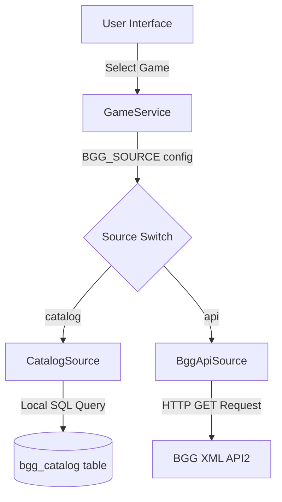
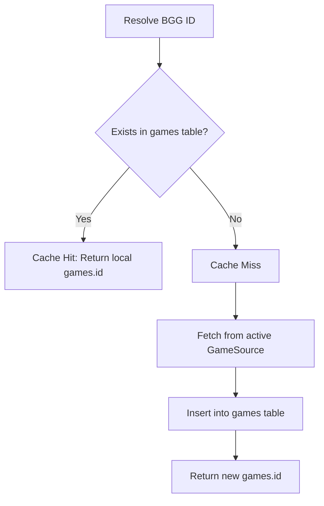

# BoardGameGeek Integration

This document details the architecture, design choices, and implementation details of the BoardGameGeek (BGG) integration in the application.

---

## 1. Integration Strategy

Board game metadata is core to the application's functionality. When users create sessions or tournaments, they specify the game being played. Rather than requiring users to manually enter all details (such as minimum/maximum players, playing time, and thumbnail URLs), the application integrates with BoardGameGeek, the industry-standard database for board game data.

To access BGG data, the application defines a unified interface (`GameSource`) that abstracts the retrieval logic. This allows the system to switch between different data strategies seamlessly.

### The GameSource Interface
The interface `GameSource` defines two essential methods:
* `search(string $query): array` - Returns a list of matching board games with basic information (BGG ID, name, release year).
* `fetch(int $bggId): array` - Returns detailed metadata for a specific game (description, players, playing time, thumbnail URL).

---

## 2. The Dual-Pipeline Architecture

The application implements two distinct strategies of the `GameSource` interface, controlled by the `BGG_SOURCE` environment variable in the `.env` file:

### CatalogSource (Local Database Index)
This strategy searches against a local database table named `bgg_catalog`. This table acts as a pre-populated search index containing approximately 30,000 top-ranked board games imported from an official BGG rank data dump.
* **Search:** Performs a prefix match SQL query (`LIKE 'Query%'`) on the `name` column, sorted by the game's ranking.
* **Fetch:** Reads basic details from the local table. (Note that because the csv dump lacks full descriptions, full details are supplemented or kept brief when using the catalog source).

### BggApiSource (Live BoardGameGeek XML API2)
This strategy sends HTTP requests directly to the official BoardGameGeek XML API2.
* **Search:** Calls `https://boardgamegeek.com/xmlapi2/search?type=boardgame&query={query}`.
* **Fetch:** Calls `https://boardgamegeek.com/xmlapi2/thing?id={bggId}` and parses the XML response using PHP's native `SimpleXML` extension.

---

## 3. Design Rationale and Alternatives

### Why the Dual-Pipeline was Implemented
In mid-2025, BoardGameGeek modified their API terms. The BGG XML API2 now requires developers to register their application and supply a Bearer token (`BGG_TOKEN`). The registration and approval process can take several weeks. Without a registered token, requests are heavily rate-limited or blocked.

A dual-pipeline approach solves this constraint:
1. **Immediate Setup:** A developer can host the application and use `BGG_SOURCE=catalog` immediately. The application is fully functional, using the local catalog file for search suggestions, without waiting for BGG API token approval.
2. **Speed and Efficiency:** Searching a local database table with indexing is instantaneous (typically under 10ms). Querying the BGG API requires an external HTTP request, XML parsing, and network roundtrip latencies, which often take 1 to 2 seconds. A slow autocompleter degrades user experience.
3. **Robustness:** If BGG servers go offline or experience rate limits, the `catalog` source offers a reliable, zero-latency backup.

### Alternatives Considered and Rejected
* **Relying Solely on the Live BGG API:** This was rejected because the application would become unusable for anyone without an approved API key. It also introduces a single point of failure (if BGG is down, users cannot create sessions).
* **Using Composer Packages for BGG Integration:** This was rejected to adhere to the project constraint of having zero external library dependencies. It keeps the codebase simple and makes deployment on basic shared hosting environments trivial.
* **Scraping BGG HTML Pages:** Scraping is unstable, violates BGG's Terms of Service, and breaks whenever BGG updates their website layout. Using the official API and data dumps is the correct, stable approach.

---

## 4. Game Cache Mechanism

To combine the speed of local database queries with the richness of live BGG API data, the application uses a caching system managed by `GameService`.

### Rationale
1. **Normalization:** The `sessions` table does not store board game names or details directly. Instead, it holds a foreign key `game_id` pointing to the `games` table. This keeps the database normalized.
2. **Performance:** Caching ensures that full details (including large descriptions and thumbnail URLs) are downloaded exactly once per board game. Subsequent sessions created for the same game reuse the cached record, saving bandwidth and execution time.
3. **Persistence:** Even if the database catalog is cleared or the BGG API changes, the `games` table maintains a persistent record of all games that have ever been played, ensuring historical sessions remain intact.

---

## 5. Catalog Import Pipeline

The helper script `import_catalog.php` is used to load data into the `bgg_catalog` search table:
1. It reads the CSV file `bg_ranks.csv` (which is the official BGG CSV export).
2. It filters out games without a rank (`rank = 0` or empty) or expansion flags (if undesired) to keep the search index clean and relevant.
3. It performs batch inserts wrapped in transactions (committing every 2,000 records) to maximize write performance and avoid holding long-lived table locks.
