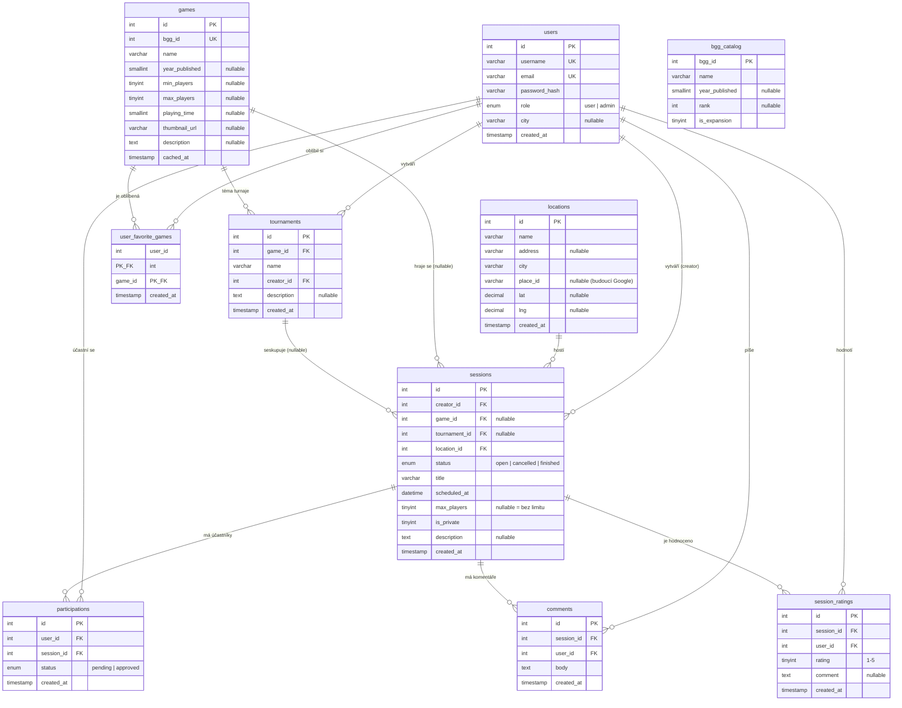

# Databázové schéma

Databáze je navržená do 3. normální formy. Všechny tabulky používají `InnoDB`
(kvůli cizím klíčům a transakcím) a kódování `utf8mb4`.

## ER diagram

## Popis tabulek

### Jádro

| Tabulka          | Účel                                                                 |
|------------------|----------------------------------------------------------------------|
| `users`          | Uživatelské účty. `role` rozlišuje běžného uživatele a admina.        |
| `locations`      | Místa konání sezení (sdílená, základ pro filtrování). Sloupce `place_id/lat/lng` jsou připravené pro budoucí napojení na mapy. |
| `games`          | **Lokální cache** dat her z BGG. `bgg_id` je unikátní — hra se z BGG stáhne jen při prvním použití. |
| `sessions`       | Herní sezení. `max_players = NULL` znamená bez limitu; `is_private` zapíná approval. |
| `participations` | M:N vazba uživatel ↔ sezení. `UNIQUE(user_id, session_id)` brání dvojí účasti; `status` řeší schvalování. |
| `comments`       | Komentáře/zprávy pod sezením.                                         |

### Rozšíření

| Tabulka               | Účel                                                            |
|-----------------------|-----------------------------------------------------------------|
| `tournaments`         | Seskupení více sezení pod jeden turnaj (ukotvený na jednu hru). |
| `user_favorite_games` | Oblíbené hry uživatele (M:N, kompozitní PK).                    |
| `session_ratings`     | Hodnocení sezení po skončení (1–5), `UNIQUE(session_id, user_id)`. |

### Pomocná

| Tabulka       | Účel                                                                          |
|---------------|-------------------------------------------------------------------------------|
| `bgg_catalog` | Vyhledávací index ~30 000 her z oficiálního BGG data dumpu. Slouží jako zdroj dat pro našeptávač bez nutnosti volat BGG API. Není provázán cizími klíči — je to samostatný read-only index. |

## Klíčová návrhová rozhodnutí

- **Volná místa se nepočítají do sloupce** — odvozují se za běhu jako
  `max_players − COUNT(participations)`. Jeden zdroj pravdy, žádná desynchronizace.
- **`ON DELETE` strategie**: závislé entity (účasti, komentáře) kaskádují s rodičem;
  lokace mají `RESTRICT` (nelze smazat používanou lokaci); hra v sezení má `SET NULL`
  (smazání hry z cache nezruší historii sezení).
- **Cache klíčovaná `bgg_id`** (`UNIQUE`) — jádro mechanismu „stáhni jen jednou".
