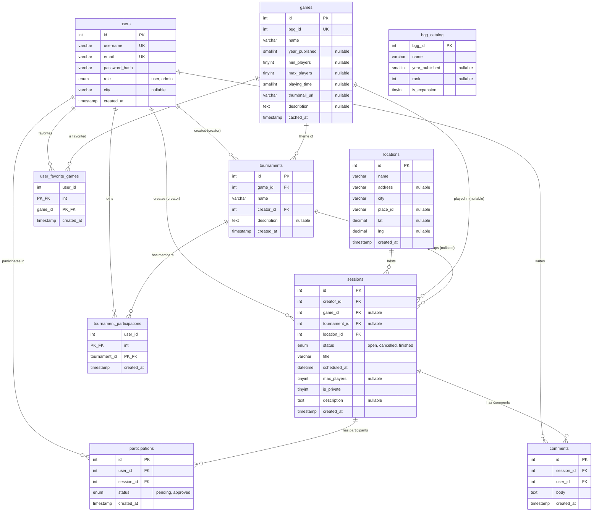

# Database Schema and Architecture

The database is designed in the Third Normal Form (3NF) to minimize data redundancy and enforce data integrity. All tables utilize the `InnoDB` storage engine and are configured with the `utf8mb4` character set to support full Unicode characters.

---

## 1. Entity-Relationship (ER) Diagram

---

## 2. Table Catalog and Descriptions

### Core Tables

| Table | Purpose |
|---|---|
| `users` | Stores registered user accounts. The `role` column ('user' or 'admin') is used for authorization routing. |
| `locations` | Physical venues where game sessions can occur. This is a shared entity to simplify address auto-completion and search filtering. Contains geographic coordinates (`lat`, `lng`, `place_id`) for map integrations. |
| `games` | Local cache representing board games previously used in the system. The `bgg_id` column is unique, ensuring that board games are cached only once. |
| `sessions` | Game sessions scheduled by users. Holds references to the creator, the venue location, the game, and an optional tournament group. |
| `participations` | Many-to-many relationship mapping users to game sessions. Contains a `status` field ('pending', 'approved') to support approval mechanisms for private sessions. |
| `comments` | In-session chat messages. Visible only to participants of that session. |

### Extensions and Social Tables

| Table | Purpose |
|---|---|
| `tournaments` | Organizes groups of sessions under a tournament banner. Managed by a creator and tied to a specific board game. |
| `tournament_participations` | Many-to-many relationship tracking which users have registered for a specific tournament. |
| `user_favorite_games` | Many-to-many mapping for users to save their favorite board games to their profile, accelerating session scheduling. |

### Helper Tables

| Table | Purpose |
|---|---|
| `bgg_catalog` | Independent, read-only search index containing approximately 30,000 board games imported from a BoardGameGeek ranks CSV dump. Used for autocompleting search inputs without invoking the external BGG XML API. |

---

## 3. Database Design Decisions and Alternatives

### Storage Engine selection: InnoDB vs MyISAM
The entire database utilizes the `InnoDB` storage engine.
* **Rationale:** `InnoDB` provides full ACID transaction support and foreign key constraints. Because the application handles user registration, session joining, and tournament sign-ups, maintaining referential integrity is critical. For instance, creating a tournament and automatically joining the creator involves multiple database writes that must succeed or fail as a single atomic unit.
* **Alternative Considered:** `MyISAM` was rejected because it does not support foreign key constraints or transactions, and it uses table-level locking instead of row-level locking, which degrades performance under concurrent write operations.

### Vacancy Calculation Strategy
The number of open spots in a session is dynamically calculated at runtime via the formula:
`vacancies = max_players - COUNT(participations) WHERE status = 'approved'`
* **Rationale:** Calculating vacancies dynamically provides a single source of truth. If a column named `vacancies_remaining` was kept in the `sessions` table, the application would need to update this count during every join, leave, or rejection action. This introduces write synchronization complexity, race conditions under high concurrent requests, and the potential for data drift.
* **Alternative Considered:** Storing the count in a database column. This was rejected due to risk of desynchronization.

### Referential Integrity and ON DELETE Strategies
To keep data consistent without leaving orphaned foreign key references, the schema defines three distinct `ON DELETE` actions:
1. **`ON DELETE CASCADE`:** Applied to `comments`, `participations`, `user_favorite_games`, and `tournament_participations`. If a user or session is deleted, it is logical to delete their association logs and comments, as these entities have no meaning without their parent entities.
2. **`ON DELETE SET NULL`:** Applied to `game_id` and `tournament_id` in the `sessions` table. If a game is deleted from cache or a tournament is dissolved, the scheduled session should still remain in the database (preserving history and location details), but the association is removed.
3. **`ON DELETE RESTRICT`:** Applied to `location_id` in the `sessions` table. A location cannot be deleted if there are any scheduled sessions referencing it. This prevents active sessions from losing venue addresses.

### Separating bgg_catalog from games Cache
The `bgg_catalog` table is isolated from the `games` table and contains no foreign key relationships.
* **Rationale:** The `bgg_catalog` is a static, high-volume search index. Keeping it decoupled from the application's actual data model ensures that the catalog database can be dropped, rebuilt, or re-imported at any time without impacting existing sessions or user records. The `games` table contains the subset of actual games currently referenced by sessions.
* **Alternative Considered:** Merging the two tables into a single `games` table. This was rejected because storing 30,000 rows of unreferenced games complicates search, makes cache management difficult, and increases database backup size.
